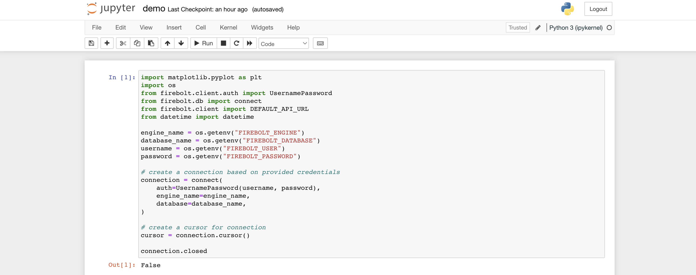
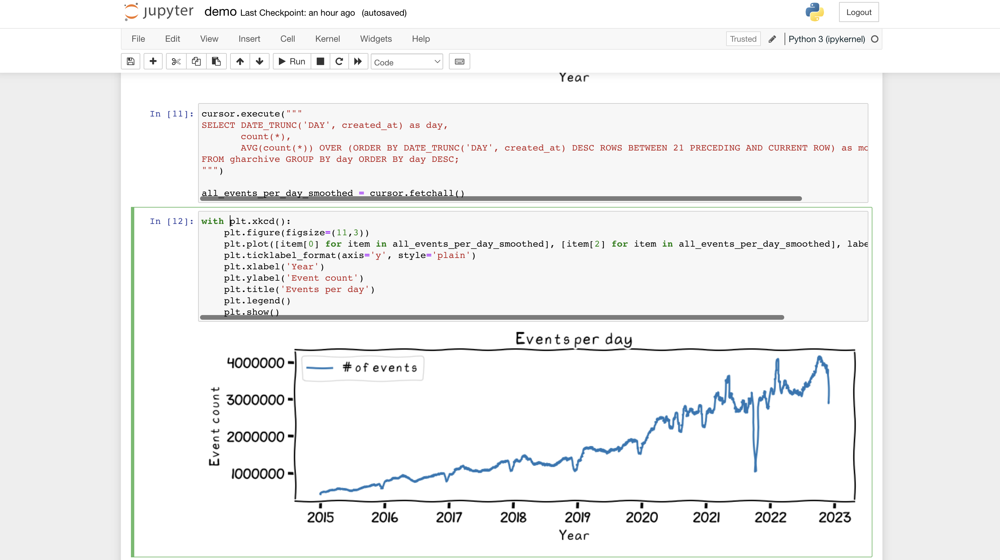

# Getting Started with Jupyter and Firebolt






You need to configure four environment variables in  your environment (or just
put them into an `.env` file as `pipenv` reads that one automatically.

```
FIREBOLT_ENGINE=
FIREBOLT_DATABASE=
FIREBOLT_USER=
FIREBOLT_PASSWORD=
```

Once this is configured, you need to install the dependencies once using pipenv

```bash
pipenv install
```

In order to start the jupyter notebook, go with

```bash
pipenv run jupyter-notebook
```

